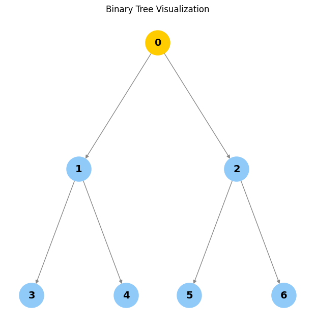
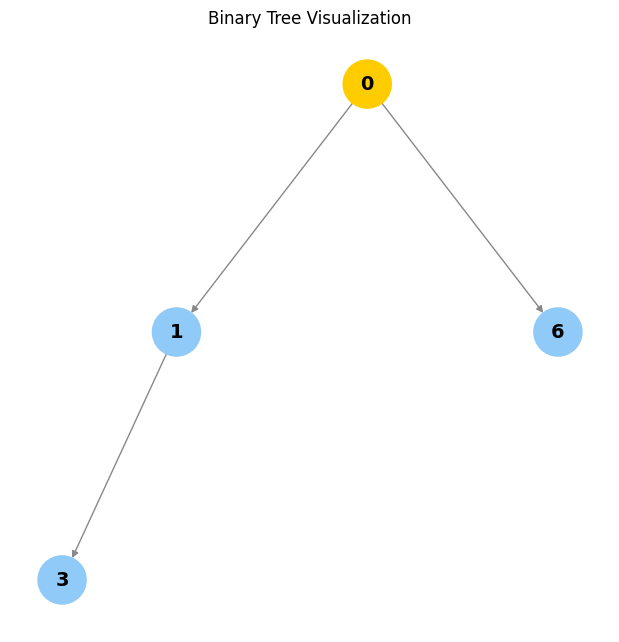
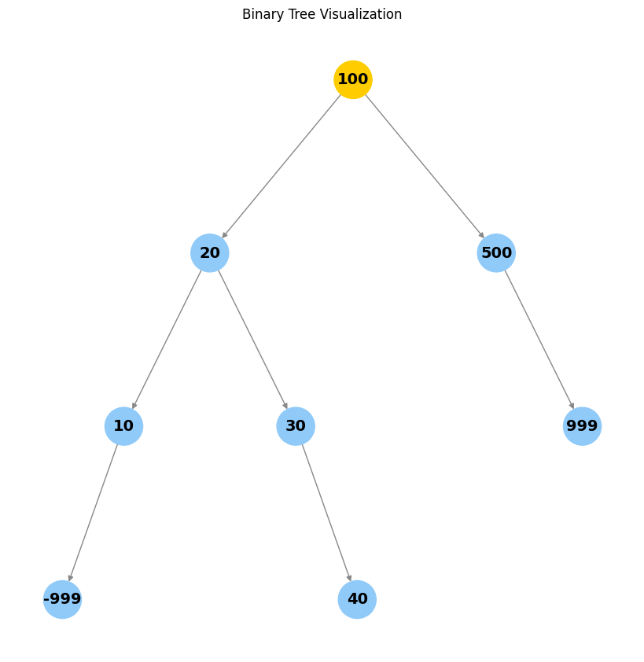
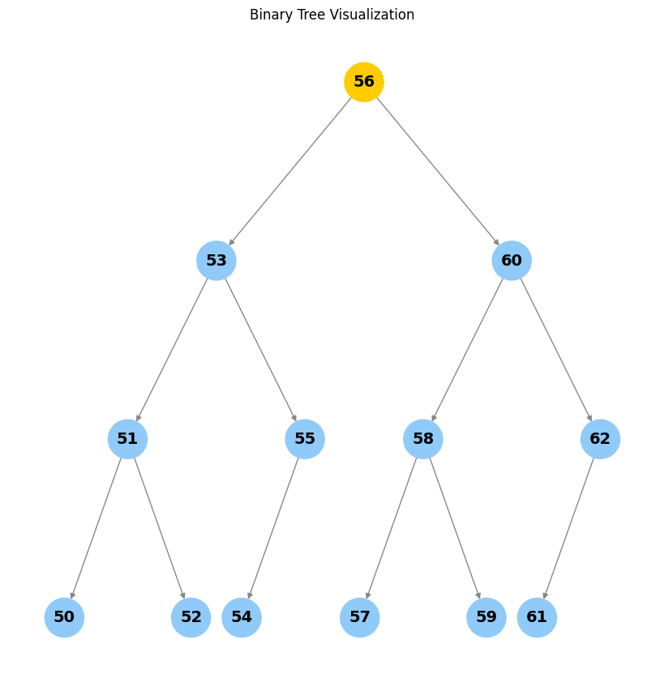

# Binary Trees: Concepts, Implementation, and Visualization


<!-- WARNING: THIS FILE WAS AUTOGENERATED! DO NOT EDIT! -->

## What is a Binary Tree?

A **binary tree** is a hierarchical data structure in which each node
has at most two children, referred to as the left child and the right
child. Binary trees are widely used for efficient data storage,
searching, and sorting.

**Use cases:** - Expression parsing - Hierarchical data representation -
Efficient searching and sorting (e.g., BSTs)

## Node Structure

Each node in a binary tree contains: - A value (data) - A reference to
the left child (or None) - A reference to the right child (or None)

Below is a visual representation of a node:

<figure>

<figcaption aria-hidden="true">Figure of a node</figcaption>
</figure>

Creating a Node

``` python
class Node:
    """A node in a binary tree."""
    def __init__(self, value, left: "Node|None"=None, right: "Node|None"=None):
        self.value = value
        self.left: Node|None = left
        self.right: Node|None = right
    
    def __str__(self) -> str:
        """A string representation of the node including its value, left, and right children."""
        left_value = f"Node({self.left.value})" if self.left else None
        right_value = f"Node({self.right.value})" if self.right else None
        return f"Node({self.value}, left={left_value}, right={right_value})"

    def __repr__(self) -> str:
        return self.__str__()
```

Creating a binary tree requires creating a set of nodes.

``` python
node1 = Node(1)
node1
```

    Node(1, left=None, right=None)

``` python
root_node = (
    Node(1,
        Node(2,
            Node(4,
                Node(8),
                Node(9)
            ),
            Node(5,
                Node(10),
                Node(11)
            )
        ),
        Node(3,
            Node(6,
                Node(12),
                Node(13)
            ),
            Node(7,
                Node(14),
                Node(15)
            )
        )
    )
)
root_node
```

    Node(1, left=Node(2), right=Node(3))

## Visualizing a Binary Tree

The function below visualizes a binary tree using NetworkX and
Matplotlib. It adapts the layout for larger trees, highlights the root,
and provides clear node labels. Optionally, you can display parent
pointers or other node attributes by customizing the label logic.

------------------------------------------------------------------------

<a
href="https://github.com/BrunodsLilly/ElitePython/blob/main/ElitePython/binary_trees.py#L14"
target="_blank" style="float:right; font-size:smaller">source</a>

### visualize_tree

>  visualize_tree (root, show_parents=False)

*Visualize a binary tree using NetworkX and Matplotlib. Args: root: The
root node of the tree. show_parents: If True, include parent values in
node labels.*

## Binary Tree Terminology

- **Node**: An object with a value, a left child, and a right child.
- **Child**: A left or right node.
- **Parent**: A node that has a child node.
- **Root**: The topmost node in a tree; it does not have a parent.
- **Leaf**: A node with no children.
- **Internal**: A node with at least one child node.
- **Depth**: The number of edges from a node to the root.
- **Height**: The number of edges on the longest path from a node to a
  leaf.

Example diagram:

        1 (root)
       /   \
      2     3
     / \   / \
    4   5 6   7

- Node 1 is the root.
- Nodes 4, 5, 6, 7 are leaves.
- Node 2 is an internal node.
- The depth of node 4 is 2.
- The height of the tree is 2.

------------------------------------------------------------------------

<a
href="https://github.com/BrunodsLilly/ElitePython/blob/main/ElitePython/binary_trees.py#L64"
target="_blank" style="float:right; font-size:smaller">source</a>

### Node

>  Node (value, left:__main__.Node|None=None, right:__main__.Node|None=None,
>            parent:__main__.Node|None=None)

*A node in a binary tree with parent pointer.*

------------------------------------------------------------------------

<a
href="https://github.com/BrunodsLilly/ElitePython/blob/main/ElitePython/binary_trees.py#L96"
target="_blank" style="float:right; font-size:smaller">source</a>

### set_parents

>  set_parents (node:__main__.Node, parent:__main__.Node|None=None)

*Set parent nodes given a root node.*

``` python
root_node = set_parents(
    Node(1,
        Node(2,
            Node(4,
                Node(8),
                Node(9)
            ),
            Node(5,
                Node(10),
                Node(11)
            )
        ),
        Node(3,
            Node(6,
                Node(12),
                Node(13)
            ),
            Node(7,
                Node(14),
                Node(15)
            )
        )
    )
)
root_node.parent, root_node.height, root_node.depth
```

    (None, 4, 0)

``` python
if root_node.left:
    print(root_node.left, "depth:", root_node.left.depth)
```

    Node(2, left=Node(4), right=Node(5), parent=Node(1)) depth: 1

## Properties of a Binary Tree

- **Maximum nodes**: 2<sup>*H*</sup> − 1 (where *H* is the height)
- **Maximum nodes at level *L***: 2<sup>*L*</sup>
- **Minimum height for *n* nodes**: ⌈log<sub>2</sub>(*n* + 1)⌉

These properties help analyze the efficiency of tree operations.

## Operations on a Binary Tree

- **Traversal**: Visiting all nodes in a binary tree.
  - Depth-First Search (DFS):
    - Preorder (node, left, right)
    - Inorder (left, node, right)
    - Postorder (left, right, node)
  - Breadth-First Search (BFS):
    - Level order
- **Insertion**: Adding a new node.
- **Deletion**: Removing a node.
- **Search**: Finding a node with a specific value.

### Traversal

------------------------------------------------------------------------

<a
href="https://github.com/BrunodsLilly/ElitePython/blob/main/ElitePython/binary_trees.py#L107"
target="_blank" style="float:right; font-size:smaller">source</a>

### create_n_nodes

>  create_n_nodes (num=5)

*Creates a perfect binary tree with num nodes.*

#### DFS

> Implemented using recursion

``` python
root = create_n_nodes(); assert root
```

------------------------------------------------------------------------

<a
href="https://github.com/BrunodsLilly/ElitePython/blob/main/ElitePython/binary_trees.py#L123"
target="_blank" style="float:right; font-size:smaller">source</a>

### dfs_inorder

>  dfs_inorder (node:__main__.Node)

*Inorder DFS traversal: left, node, right.*

------------------------------------------------------------------------

<a
href="https://github.com/BrunodsLilly/ElitePython/blob/main/ElitePython/binary_trees.py#L134"
target="_blank" style="float:right; font-size:smaller">source</a>

### dfs_preorder

>  dfs_preorder (node:__main__.Node)

*Preorder DFS traversal: node, left, right.*

------------------------------------------------------------------------

<a
href="https://github.com/BrunodsLilly/ElitePython/blob/main/ElitePython/binary_trees.py#L144"
target="_blank" style="float:right; font-size:smaller">source</a>

### dfs_postorder

>  dfs_postorder (node:__main__.Node)

*Postorder DFS traversal: left, right, node.*

#### BFS

> Implemented using a queue

------------------------------------------------------------------------

<a
href="https://github.com/BrunodsLilly/ElitePython/blob/main/ElitePython/binary_trees.py#L154"
target="_blank" style="float:right; font-size:smaller">source</a>

### bfs

>  bfs (node:__main__.Node)

*Breadth-first search (level order traversal).*

### Insertion

Insertion uses BFS to find the first node without a left or right child
and inserts the new node there. This keeps the tree as balanced as
possible (but does not guarantee a balanced tree).

------------------------------------------------------------------------

<a
href="https://github.com/BrunodsLilly/ElitePython/blob/main/ElitePython/binary_trees.py#L167"
target="_blank" style="float:right; font-size:smaller">source</a>

### insert_node

>  insert_node (root:__main__.Node, value)

*Level-order BFS insert. Inserts a new node with the given value.*

``` python
root = create_n_nodes(7)
insert_node(root, "new1")
insert_node(root, "new2")
insert_node(root, "new3")
insert_node(root, "new4")
```

## Search

You can search for a value in a tree using any traversal method. The
function below is generic and works with any traversal.

------------------------------------------------------------------------

<a
href="https://github.com/BrunodsLilly/ElitePython/blob/main/ElitePython/binary_trees.py#L184"
target="_blank" style="float:right; font-size:smaller">source</a>

### search_tree

>  search_tree (root:__main__.Node, value, traversal_func:Callable[[__main__
>                   .Node],Generator[__main__.Node,NoneType,NoneType]])

*Search for a node with the given value using the specified traversal
function.*

``` python
root = create_n_nodes(7)
print(search_tree(root, 1, dfs_inorder))
print(search_tree(root, 2, dfs_preorder))
print(search_tree(root, 3, dfs_postorder))
print(search_tree(root, 4, bfs))
print(search_tree(root, 5, dfs_inorder))
```

    Node(1, left=Node(3), right=Node(4), parent=Node(0))
    Node(2, left=Node(5), right=Node(6), parent=Node(0))
    Node(3, left=None, right=None, parent=Node(1))
    Node(4, left=None, right=None, parent=Node(1))
    Node(5, left=None, right=None, parent=Node(2))

## Deletion

Deleting a node requires: 1. Finding the node to delete. 2. Swapping it
with the right-most (deepest) node to preserve structure. 3. Removing
the right-most node.

> Note: For binary search trees, deletion must preserve the BST
> property. The method below is for general binary trees.

------------------------------------------------------------------------

<a
href="https://github.com/BrunodsLilly/ElitePython/blob/main/ElitePython/binary_trees.py#L193"
target="_blank" style="float:right; font-size:smaller">source</a>

### delete_node

>  delete_node (root:__main__.Node, value=None)

*Deletes the node with the given value by swapping with the right-most
node.*

``` python
visualize_tree(create_n_nodes(7))
visualize_tree(delete_node(delete_node(create_n_nodes(7), 2), 5))
visualize_tree(delete_node(Node(1), 1))
visualize_tree(delete_node(Node(1, left=Node(2)), 1))
```





    Empty tree


## Types of Binary Trees

- **By children**
  - Full: Every node has 0 or 2 children.
  - Degenerate: Each parent has only one child (like a linked list).
  - Skewed: All nodes are either to the left or right.
- **By levels**
  - Complete: All levels are filled except possibly the last.
  - Perfect: All internal nodes have two children and all leaves are at
    the same level.
  - Balanced: Height is minimized.
- **By values**
  - Binary search tree (BST)
  - AVL
  - Red Black
  - B, B+
  - Segment

Add diagrams or ASCII art for each type for further clarity.

# Binary Search Trees (BST)

A **binary search tree** is a subtype of binary tree that efficiently
stores sorted data.

- The left subtree of a node contains only nodes with keys less than the
  node’s key.
- The right subtree of a node contains only nodes with keys greater than
  the node’s key.
- The left and right subtree each must also be a binary search tree.
- There must be no duplicate nodes (BSTs may have duplicate values with
  different handling approaches).

**When not to use:** Use a hash table if all you need is search, insert,
and delete, because a hash table does these operations in O(1) time
complexity.

**When to use:** When you need to maintain a traversable, sorted stream
of data you can search, insert, delete, ceiling, max, and min in O(h)
time, where h is the tree’s height. There are subtypes of binary search
trees (AVL, Red Black Trees) that minimize height.

> When rolling out a BST in practice, consider AVL and Red Black Trees
> to optimize operations.

## BST Insertion

When adding a new node, traverse the tree. If the new node’s value is
greater than the current node, move right; else move left. Once you hit
a leaf node, add the node as a child. Duplicate values are not allowed
in this implementation.

------------------------------------------------------------------------

<a
href="https://github.com/BrunodsLilly/ElitePython/blob/main/ElitePython/binary_trees.py#L249"
target="_blank" style="float:right; font-size:smaller">source</a>

### bst_insert

>  bst_insert (root:__main__.Node, new_node:__main__.Node)

*Insert a new node into a BST. Raises an exception if value exists.*

``` python
root = set_parents(
    Node(
        100,
        left=Node(
            20,
            left=Node(10),
            right=Node(30),
        ),
        right=Node(500),
    )
)
bst_insert(root, Node(40))
bst_insert(root, Node(999))
bst_insert(root, Node(-999))
visualize_tree(root)
# Uncomment to see exception for duplicate insertion:
# bst_insert(root, Node(30))
```



``` python
def sorted_list_to_bst(vals) -> Node|None:
    """Given a sorted list, returns the root of a balanced BST."""
    if not vals:
        return None
    mid = len(vals) // 2
    node = Node(vals[mid])
    node.left = sorted_list_to_bst(vals[:mid])
    if node.left:
        node.left.parent = node
    node.right = sorted_list_to_bst(vals[mid+1:])
    if node.right:
        node.right.parent = node
    return node

def generate_balanced_bst(start, n) -> Node|None:
    """Create a balanced BST of values start...start+n-1."""
    return sorted_list_to_bst(list(range(start, start+n)))

r = generate_balanced_bst(50, 13)
assert isinstance(r, Node)
visualize_tree(r)
```



``` python
[i.value for i in dfs_inorder(r)]
```

    [50, 51, 52, 53, 54, 55, 56, 57, 58, 59, 60, 61, 62]

------------------------------------------------------------------------

<a
href="https://github.com/BrunodsLilly/ElitePython/blob/main/ElitePython/binary_trees.py#L269"
target="_blank" style="float:right; font-size:smaller">source</a>

### bst_search

>  bst_search (root:__main__.Node|None, key)

*Search for a key in a BST. Raises an exception if not found.*

``` python
bst_search(r, 60)
```

    Node(60, left=Node(58), right=Node(62), parent=Node(56))

## BST Deletion (Overview)

The goal is to delete a node while maintaining order. There are three
cases:

1.  The node is a leaf node (just remove it).
2.  The node has one child (replace it with its child).
3.  The node has two children (replace it with its in-order successor or
    predecessor).

> Implementing full BST deletion is left as an exercise.

# Tests: Node Creation

``` python
n = Node(42)
assert n.value == 42
assert n.left is None
assert n.right is None
n2 = Node(1, left=n)
assert n2.left is n
assert n2.right is None
```

# Tests: Parent Pointer and set_parents

``` python
root = Node(1, Node(2), Node(3))
set_parents(root)
assert root.parent is None
assert root.left.parent is root
assert root.right.parent is root
```

# Tests: **str** and **repr**

``` python
s = str(root)
r = repr(root)
assert "Node(1" in s
assert s == r
```

# Tests: height and depth

``` python
tree = create_n_nodes(7)
set_parents(tree)
assert tree.height == 3
assert tree.left.left.depth == 2
```

# Tests: Traversals

``` python
inorder = [n.value for n in dfs_inorder(tree)]
preorder = [n.value for n in dfs_preorder(tree)]
postorder = [n.value for n in dfs_postorder(tree)]
bfs_order = [n.value for n in bfs(tree)]
assert set(inorder) == set(preorder) == set(postorder) == set(bfs_order) == set(range(7))
```

# Tests: Insertion

``` python
tree2 = create_n_nodes(3)
insert_node(tree2, 99)
# The new node should be a child of one of the leaves
found = False
for n in [tree2.left, tree2.right]:
    if n.left and n.left.value == 99:
        found = True
    if n.right and n.right.value == 99:
        found = True
assert found
```

# Tests: Search

``` python
tree3 = create_n_nodes(5)
assert search_tree(tree3, 2, dfs_inorder).value == 2
assert search_tree(tree3, 99, dfs_inorder) is None
```

# Tests: Deletion (leaf, one child, root)

``` python
t = create_n_nodes(3)
t = delete_node(t, 2)
assert all(n.value != 2 for n in dfs_inorder(t))
t2 = Node(1, Node(2))
t2 = delete_node(t2, 1)
assert t2.value == 2
```

# Tests: BST insert and search

``` python
bst = Node(10)
bst_insert(bst, Node(5))
bst_insert(bst, Node(15))
assert bst.left.value == 5
assert bst.right.value == 15
try:
    bst_insert(bst, Node(5))
    assert False, "Duplicate insert should raise"
except Exception:
    pass
assert bst_search(bst, 15).value == 15
try:
    bst_search(bst, 99)
    assert False, "Search for missing value should raise"
except Exception:
    pass
```

# Tests: Balanced BST from sorted list

``` python
sorted_bst = generate_balanced_bst(0, 7)
assert sorted_bst.value == 3
assert sorted_bst.left.value == 1
assert sorted_bst.right.value == 5
assert [n.value for n in dfs_inorder(sorted_bst)] == list(range(7))
```

# Tests: Edge cases (single node, empty search)
